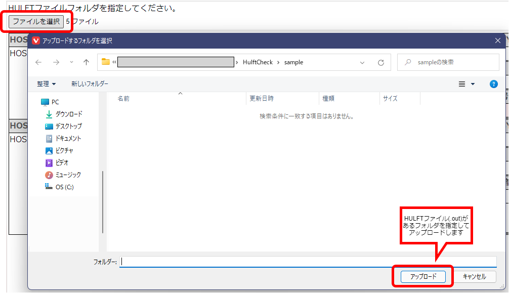
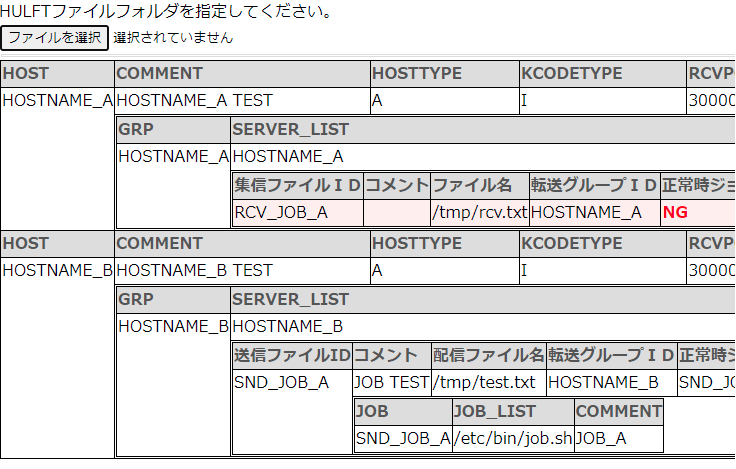

# HulftCheck
HULFTの集信・配信定義を一覧で表示します。

## Usage

1. HULFTの情報を取得
	* Windows

		```
		hulft_list.bat
		```
	* Linux

		```
		./hulft_list.sh
		```
	※実行ファイルや出力するフォルダは適宜、batファイルを修正してください。

1. HULFTの定義を確認
	* huflt_check.htmlをブラウザで表示
	* ファイルを読み込み

	

	* HULFTの構成が表示されます。

	

	※定義に漏れがある箇所は、赤く表示されます。

